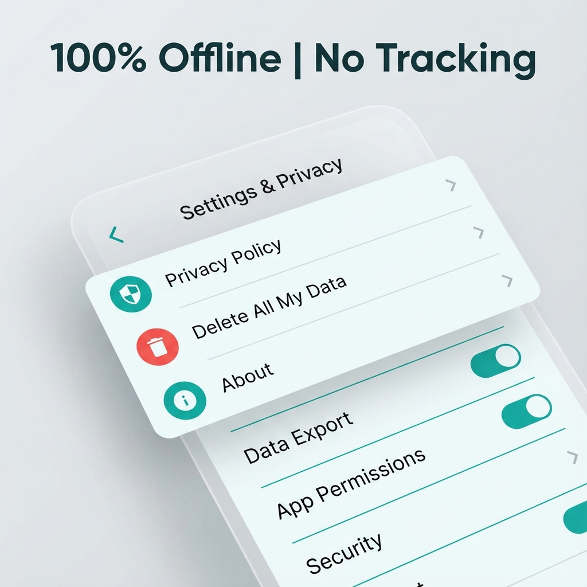

# Micro-Habits Tracker

A privacy-focused, zero-permission Flutter app for building lasting routines. This app is designed with the 2025 Google Play Store policies in mind: Offline-first, no tracking, and 100% user control.

## 🚀 Key Features
- **Privacy-by-Design**: No internet, no analytics, no third-party SDKs.
- **Zero Permissions**: Requires absolutely no device permissions.
- **Local Persistence**: Fast, encrypted-ready local SQLite storage.
- **Modern UI**: Built with Google Fonts (Outfit) and Material 3 Teal Gradients.
- **Performance**: 60FPS smooth transitions and optimized keyboard focus handling.

## 📱 App Mockups

## 🛠️ Tech Stack
- **Framework**: Flutter (Dart)
- **Local DB**: `sqflite`
- **State Management**: `provider`
- **Design**: Material 3 + Google Fonts

## 📋 Project Structure
- `lib/data/`: Database helpers and state management.
- `lib/ui/`: All app screens and components.
- `compliance/`: Privacy Policy and Data Safety documentation.
- `assets/`: App icon and marketing mockups.

## ⚖️ Compliance
This app includes a **"Delete All My Data"** feature in the settings to ensure users have full control over their local database, satisfying Google's user data deletion requirements.

---
*Built for Privacy. Focused on Growth.*
